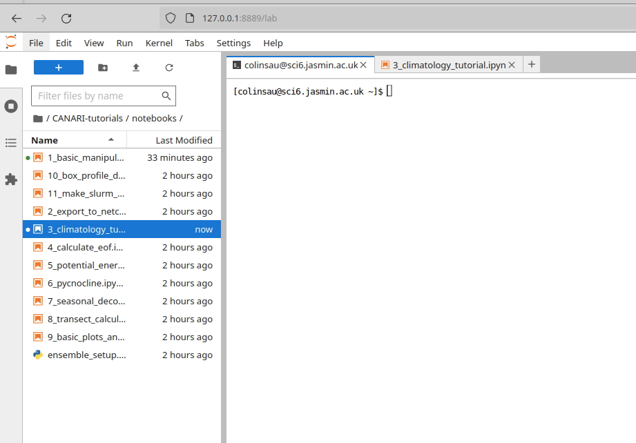

## Running on the JASMIN Sci Servers
The JASMIN notebook service only has limited resources and might not be sufficient for some larger datasets. One alternative is to use the Sci servers. These are 8 shared servers which JASMIN users can login to and run code on.

### Logging on to the Sci servers
First login to the JASMIN login server (replace <jasminusername> with your own username):

`ssh -A <jasminusername>@login1.jasmin.ac.uk`

Do not forget to add the `-A` option to add your SSH key to the session.

Then login to one of the sci servers, there are 8 of these in total called sci1-8.

`ssh sci6`

Or this can all be wrapped up in one command using an SSH "jump host" with:
`ssh -J <jasminusername>@login1.jasmin.ac.uk <jasminusername>@sci6`

### Anacionda, Miniconda or Micromamba?
Unlike the Notebook server neither Conda or Mamba are installed by default on the Sci servers and we must install them ourselves. There are three possible options:

1. [Anaconda](https://www.anaconda.com/download) - A heavyweight distribution with many popular packages pre-installed. This is about 1 gigabyte in size.
2. [Miniconda](https://docs.anaconda.com/free/miniconda/index.html) - A lightweight dsitribution with only a few packages such as Python pre-installed. This is about 140 megabytes in size.
3. [Micromamba](https://github.com/mamba-org/micromamba-releases) - The mamba package manager and nothing else, we can use this to install Python and any other packages we need. This is only 14 megabytes.

All of these provide us with the conda or mamba package manager and let us download more packages if needed. Since it is the smallest and simplest, we'll use micromamba for this example. Feel free to follow the links above and use Anaconda or Miniconda if you prefer. 

### Installing Micromamba
 To download Micromamba run the following:
`"${SHELL}" <(curl -L https://micro.mamba.pm/install.sh)`

This will then ask several questions about configuring Micromamba:

 - When prompted for a micromaba binary folder choose the default choice of ~/.local/bin by pressing enter.
 - Say yes to "Init shell (bash)"
 - Say yes to "Configure conda-forge"
 - For the Prefix Location put "~/.conda", this will store mamba environments in the same location as the notebook service was using. Micromamba will be compaitble with them.
 - After micromamba has finished installing you will either need to logout and back in again or refresh your shell by typing `source ~/.bashrc`. 

At this point you should be able to run the micromamba command as a substitute for any of the mamba/conda commands we've used before. To test this run `micromamba env list` and you should get a list of all of your environments that you've used on the notebook service. 

### Activating the shared CANARI environment
If you want to run any code in the shared CANARI environment then you need to "activate" that enviroment (or use the micromamba run command). To do this run:
`micromamba activate -p /gws/smf/j04/canari/conda-env`
Your prompt should now change to start with `(/gws/smf/j04/canari/conda-env)` to indicate that this environment is now active. 

### Running a JupyterLab instance on a Sci server
It is recommended that you use your own copy of CANARI environment for this. If you haven't already made one see the instructions in [tutorial 3 - Creating Your Own Conda Enviroment](/creating_your_own_conda_env/). Assuming you ran this tutorial you should have an environment called `canari`, go ahead and activate this by running:
`micromamba activate canari`

JupyterLab was already started and can be run with the command:
`jupyter-lab`
This will put a lot of text onto the screen, but at the bottom it will say something like:

```
   To access the server, open this file in a browser:
        file:///home/users/colinsau/.local/share/jupyter/runtime/jpserver-27367-open.html
    Or copy and paste one of these URLs:
        http://localhost:8889/lab?token=cb9017ebaf05fa72769e7136bbfed6373ddf12e5dd9213d7
        http://127.0.0.1:8889/lab?token=cb9017ebaf05fa72769e7136bbfed6373ddf12e5dd9213d7
```
The JupyterLab is now running on the sci server you are logged into and listening to requests on port 8889 (your port number might be different, pay attention to this!). But to connect to it we need to open another SSH session. Note that you must leave this SSH session/terminal window open, if you press ctrl+c or close it then the JupyterLab session will stop. To open another SSH session open another terminal and run:

`ssh -J <jasminusername>@login1.jasmin.ac.uk -L 8889:localhost:8889 <jasminusername>@sci6`

This will bring up a new terminal logged into sci6, but it will also forward requests on your own computer's port 8889 to sci6's port 8889 allowing you to access your Jupyter server on sci6. Now open a web browser and paste in one of the URLs starting "http://" from the output from starting JupyterLab. 



#### Shutting down your JupyterLab instance

To shutdown your JupyterLab instance press the control key and c at the same time (ctrl+c) in the window where JupyterLab was running. It will ask you `Shutdown this Jupyter server (y/[n])?` press y and enter and then it will shutdown the JupyterLab instance.


